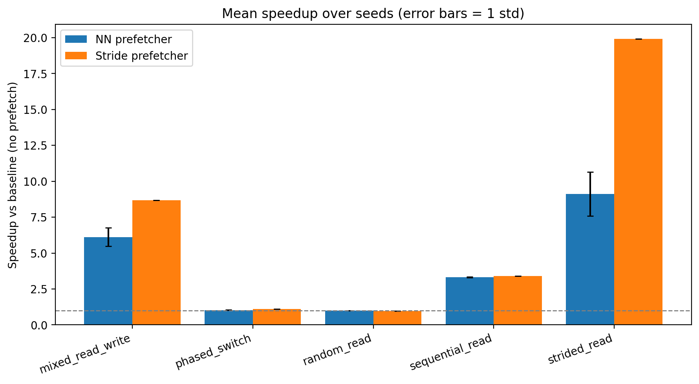
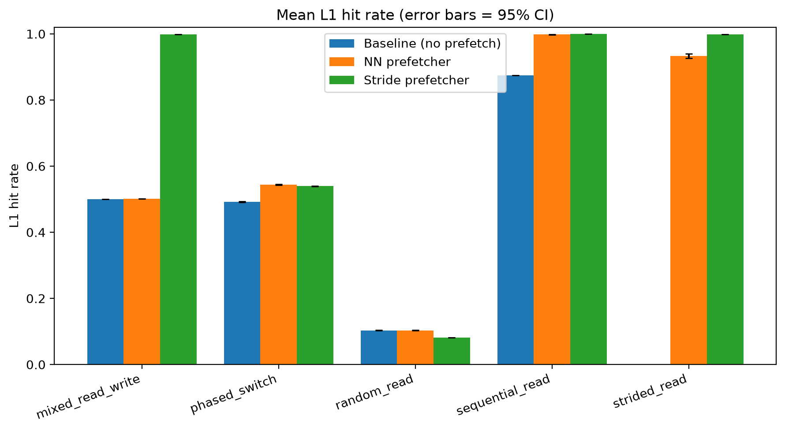
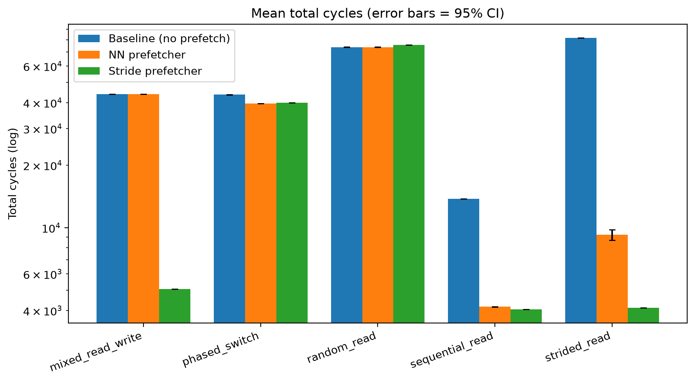
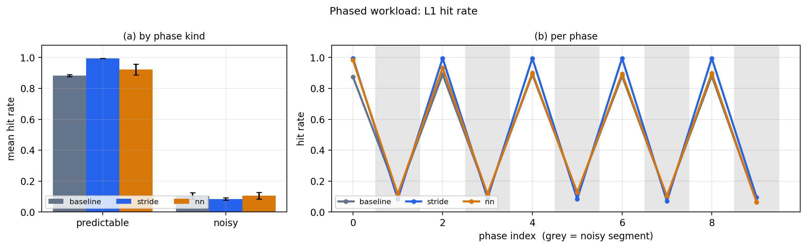

# Results

## Current matched-control finding

### Native frozen holdout

The primary external artifact is `results/champsim_holdout_standard/`: 36
native ChampSim runs over nine previously unobserved SPEC CPU2017 programs,
using the highest-weight public DPC-3 SimPoint per program, 50M warm-up and
200M measured retired instructions. The gate-disabled port is exactly equal to
official `ip_stride` on every recorded output field and every trace.

Regularity-gated stride versus matched raw stride:

| endpoint / proxy | holdout result |
|---|---:|
| geometric-mean IPC ratio | 0.994336 (−0.566%) |
| bootstrap 95% CI | 0.984451–0.999997 |
| wins / losses; exact sign p | 4 / 5; 1.0 |
| accepted L1D prefetches | −36.77% aggregate |
| L2C / LLC prefetch misses | −7.33% / −6.85% |
| DRAM read requests | −0.083% |
| accepted-prefetch accuracy | 10.64% → 15.62% |
| useful-prefetch retention | 92.83% |

Raw stride and gated stride are 1.06691x and 1.06087x faster than no L1D
prefetching. The gate's average cost is dominated by `gcc` (−4.37%); all other
gate/raw ratios are 0.99626–1.00076, explaining why the magnitude-sensitive
bootstrap and direction-only sign test differ. Every trace's DRAM change is
within the frozen ±1% descriptor.

The scientifically defensible conclusion is not that the gate saves memory
bandwidth. It improves shallow proxy metrics, but most suppressed prefetches
either never descend the hierarchy or return as demand traffic. This result
confirms the pre-specified methodological prediction that accepted-prefetch
count and accuracy cannot substitute for endpoint measurements.

Verify raw reconstruction, official-control equality, frozen predictions,
source/config hashes, and optionally binary/trace hashes with:

```bash
python champsim/verify_results.py \
  --results results/champsim_holdout_standard
```

### Local matched-control study

The canonical research artifact is `results/research_gate_validation/`:
21,240 raw rows, development seeds 0–9, disjoint holdout seeds 10–39, three
machine profiles, and a complete lookahead sensitivity sweep. Repeated
deterministic traces are collapsed to one independent unit rather than treated
as 30 samples.

At the predeclared constrained-profile lookahead of 8, dominant-delta
regularity filtering improves raw stride by 1.08838x on random, 1.07587x on
phased, and 1.01594x on agent-RAG traffic. It removes 99.55%, 83.07%, and
20.86% of accepted requests, respectively. It is unchanged on the selected
sequential, strided, mixed, embedding, and KV controls.

The result has counterexamples: agent-RAG regresses in the ideal profile and a
single merge-sort trace regresses at lookahead 1. The MLP has a conditional
1.10087x advantage over regularity-filtered stride on timed KV traffic, but no
random advantage and large losses on strided/mixed streams. The defensible
contribution is the matched-control audit plus the regularity admission filter,
not general NN superiority.

Verify raw aggregation, statistical units, provenance, and claims with:

```bash
python -m benchmarks.verify_research
```

## Legacy idealized paper dataset

Canonical run: **30 seeds**, 5 workloads × 3 configs, 2000 instrs, numpy MLP.
Everything here is regenerable with:

```bash
python benchmarks/paper_experiments.py      # full battery
python benchmarks/ablation_experiments.py   # feature / backend / warm-up ablations
python benchmarks/stat_tests.py             # paired significance tests
```

## Main results (mean over 30 seeds)

| Workload | Baseline | Stride | NN (95% CI) | Hit base→stride→nn |
|---|---|---|---|---|
| sequential_read | 13 750 | 3.40x (1.000) | **3.305x ± 0.013** (0.998) | 0.88 → 1.00 → 1.00 |
| strided_read | 82 000 | 19.92x (0.999) | **9.103x ± 0.537** (0.933) | 0.00 → 1.00 → 0.93 |
| mixed_read_write | 43 984 | 8.69x (0.999) | **1.003x** (0.502) | 0.50 → 1.00 → 0.50 |
| random_read | 73 952 | 0.978x (0.082) | **1.00028x ± 0.00017** (0.103) | 0.10 → 0.08 → 0.10 |
| phased_switch | 43 629 | 1.093x (0.540) | **1.103x ± 0.002** (0.544) | 0.49 → 0.54 → 0.54 |

**Verified take-away**: the NN helps sequential, strided and phased traffic,
but the current relative gate almost completely disables it on mixed traffic.
On `random_read` it is slightly better on average, yet it is not universally
safe: 18/30 runs exactly match baseline and 1/30 is 39 cycles worse.

The paper profile assumes instantaneous prefetch completion. With
`prefetch_latency=40`, the verifier measures only about 1.02x on the smooth
streams; the larger numbers above are therefore an ideal-timeliness bound.

### Figures







**The money plot** — phased workload, hit rate per phase (grey = noisy):



The NN follows baseline in the grey (noisy) phases where stride collapses
below baseline, and re-learns the predictable phases.

## Ablations

**Features** (speedup on strided_read / mixed_read_write): dropping the
absolute address feature **helps a lot** — `delta_only` and `no_abs_addr`
≈ 16.5x vs 8.3x for the full encoding; removing `pc` hurts.

| variant | strided | mixed | 
|---|---|---|
| full | 8.3x | 6.2x |
| delta_only | **16.5x** | **8.1x** |
| no_abs_addr | **17.0x** | 8.0x |
| no_pc | 6.9x | 6.5x |

**MLP backend**: numpy is **~9x faster** than sklearn end-to-end with
statistically identical hit rates (0.93–0.99).

The old threshold and feature-ablation directories predate source hashing and
are retained as exploratory data, not verified paper evidence. The corrected
absolute-threshold sweep disables relative scaling explicitly; regenerate it
before drawing conclusions from those tables.

**Significance:** Wilcoxon comparisons are aligned by seed and corrected as
one family with Holm's method. The NN differs from baseline on every workload,
including random (`p_holm=0.008`), while the per-seed safety counterexample is
reported separately. Full output is in `results/final_30/statistics.csv`.

## ML / agent traces (`results/exp_traces`, 8 seeds)

Access patterns mapped to real workload classes (LLM KV cache, sparse
embeddings, RAG agent loop, token stream):

| trace | baseline | stride | NN (median gate) |
|---|---|---|---|
| token_stream (sequential) | 1.00x | 3.40x | **3.20x** |
| agent_rag (phased) | 1.00x | 2.14x | **1.95x** |
| embedding_lookup (sparse) | 1.00x | 1.88x | **1.62x** |
| kv_cache_append (seq+gather) | 1.00x | 1.97x | **1.33x** |

**Robustness fix (issue #2 partial):** switching the confidence gate from
mean to **median** error and **clamping training deltas to ±16 words** lets
the NN handle sparse *gather* streams without being tripped ("everything
looks unpredictable"). Ablation (`results/exp_gate_aggregators`): embedding
1.00x→1.64x, kv_cache 1.00x→1.33x, agent_rag 1.84x→1.95x. These archived
numbers do not establish a no-regression guarantee.

## Published baselines, modeled in-simulator (`results/exp_baselines*`)

Simplified Next-Line and delta-Markov (`berti`) models in
`nncpu/baselines.py`, compared on synthetic + patterns + instrumented algorithm
traces** (merge sort, matmul, binary search from `capture_real_trace.py`):

| workload | baseline | stride | nextline | berti | NN |
|---|---|---|---|---|---|
| token_stream | 1.00x | 3.40x | 3.40x | 3.40x | 3.20x |
| random_read | 1.00x | 0.98x | 1.00x | 0.98x | **1.00x** |
| real_bsearch | 1.00x | 0.80x | 0.98x | **1.43x** | 1.00x |
| real_matmul | 1.00x | 1.65x | **1.72x** | 1.04x | 1.00x |
| real_mergesort | 1.00x | 1.15x | **1.43x** | 1.22x | 1.00x |
| kv_cache_append | 1.00x | 1.97x | 1.00x | **2.76x** | 1.33x |

Correcting byte/word address units removes the previously reported 9--11x
real-trace speedups. Next-line remains best on matmul and merge sort, while the
NN remains essentially inactive. These are instrumented algorithm traces, not
native SPEC/ChampSim execution traces.

Full raw data lives under `results/` (see `README.md` for the layout).
